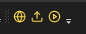

# Visual Studio Extension for CodinGame

This extension allow to use Visual Studio to push your code on [CodinGame.com](https://codingame.com).  
It uses [Selenium](https://www.selenium.dev/) to control the website directly from VS.  
You can use multiple files/class in your project.

Get the extension on the MarketStore : [CodinGameExtension](https://marketplace.visualstudio.com/items?itemName=RenaudR.CodinGameExtension) or in VS go to Extensions > Manage Extensions > CodinGameExtension

After the extension is installed, you need to add the CodinGame Extension Toolbar to your main Toolbar: 

* First icon allow to launch the browser with CodinGame. The first time, you need to login then you can navigate to the exercice you want. See how to start directly on the exercice you want below.
* The second button push the current project into your exercice.
* The third button do the same thing and launch the test.

## Starting directly on your exercise

The first time you'll launch the browser with a given project, it'll start on the CodinGame homepage. The extension will also add a line looking like `<ProjectExtensions><VisualStudio><UserProperties CodingameExtension.StartupUrl="https://www.codingame.com/" /></VisualStudio></ProjectExtensions>` in your project (`.*proj`) file. You can then set the value of this property to tell the browser to start on a given url (for example `https://www.codingame.com/ide/puzzle/spring-challenge-2023-ants` if your project is related to the spring challenge 2023).

## Limitations
It only works for C# and Python project but can easily be improved for others languages.  
In case you close the firefox window, you need to restart Visual Studio.  
It's not a Visual Studio Code extension.
Session cookies management is hazardous

----------
Please report bug or improvement request in [Github Issues](https://github.com/dk588/CodingGameExtension/issues)
